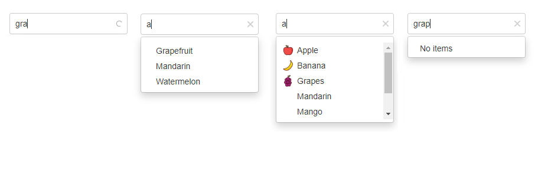

# "Autocomplete" Widget Documentation

Autocomplete component offers the following features:
* Single Selection
* Search Autocompletition
* Scrollbar Control
* Localization 
* Item customization
* Async data loading
* Customizable Callbacks



# Usage
Select component can be imported like this:
```javascript
import { Autocomplete } from "@fdefelici/react-bootstrap-combobox"

...

<Autocomplete
    searchFun={ (text, callback) => { /* load your data and populate widget data using the callback */ } }
/>
```

> For a full working example take a look at the [local example](example/) or at the [live demo](https://codesandbox.io/s/github/fdefelici/react-bootstrap-combobox/tree/v1.6.0/example?fontsize=14).

# Configuration
This component allow customization tweeking the following attributes:

| Attribute | Type | Description | Default |
|  ---: | :--- | :---        | :---    |
| `data` | array | Data attribute can have following format: <ul><li>list of strings: `["Apple", "Banana"]`, <b>or</b></li><li>list of objects, e.g. `[{label: "Apple", value: "apple", icon: <span className={"glyphicon glyphicon-plus"}></span>}]` where the attributes `icon` is optional (see details in [Data Attribute paragraph](#data-attribute-explained)).</li></ul>  | []  |
| `disabled` | boolean | Disable the field | false |
| `delay` | integer | Seconds after whom `searchFun` is called | 0 |
| `id` | string | html element ID  | none  |
| `labels` | object | Localization support (see details in [Localization paragraph](#localization-support)) | - |
| `maxDropdownItems` | integer | Max number of visible items in dropdown menu | 6 |
| `onChangeAfterCharNum` | integer | Number of chars after whom `searchFun` will start | 1 |
| `onClear` | function | Function called when you click on clear button | none |
| `onSelection` | function | Function called when an item is selected | none |
| `searchFun` | function | Function called when you start to type. It has to be with the following signature: `function (text, callback)` where `text` it will be the typed text and the callback is the function called when data will be retrieved (see details in the [example](example/)) | none  |
| `value` | string | Value to set as input string; when it changes `searchFun` won't be called   | none  |
| `width` | string | Set the widget width (css style: e.g. 100px, 60%...) | 100%  |


## Data Attribute Explained
When data is an array objects, it is possibile to specify the following fields:

| Attribute | Type | Mandatory | Description | 
|  ---: | :--- | :---        | :---    |
| `label` | string | yes | the text shown to the user for the item |
| `value` | string | yes | the value retrieved on user selection |
| `icon` | html | no | attach an icon using plain html or react component. For rendering reason the **Maximum Height** of this component is set to **20px** |


> NOTE: It is not mandatory to make every item have the same format. So for each one it is possible to use the fields needed. (For instance it is possibile to define some item with icon and others without).

Some examples of usage:
```javascript
    data={[
        { label: "Apple", value: "apple", icon: },
        { label: "Banana", value: "banana", icon: <span className={"glyphicon glyphicon-plus"}></span>},
        { label: "Citrus", value: "citrus"},
        { label: "Mango", value: "mango"}
    ]};
```

## Localization Support
Using ```labels``` attribute it is possible to customize any text the component shows.

| Attribute | Type | Description | Default |
|  ---: | :--- | :---        | :---    |
| `cap.placeholder` | string | Shown when nothing was typed | "Search..." |
| `lst.empty` | string | Label used when `data` is an empty array | "No Items" |

**Example**

Example of fully labels customization:
```javascript
<Autocomplete
    ...
    labels={{
        "cap.placeholder": "Search..."
    }}
/>
```
